+++
date = '2025-03-19T10:12:05+02:00'
draft = 'False'
title = 'Authentication Policy Silos defensive strategies'
author = "Benoit Estrade" 
ShowToc = true
TocOpen = true
Tags = ["ActiveDirectory"]
+++

# What's Kerberos FAST

In April 2011,  [RFC6113](https://datatracker.ietf.org/doc/html/rfc6113) introduce an upgrade to Kerberos user pre-authentication named **Kerberos armoring** (or Kerberos FAST for Flexible Authentication via Secure Tunneling). In 2012, Microsoft implements this upgrade in its new Active Directory functional level. 

## Core concept
Kerberos initial pre-authentication steps are vulnerable to password cracking. Computer AD account password are complex enough to mitigate this type of attacks. User AD account password are less complex. Since users authenticate on domain computers that have already authenticated to the domain, the idea of FAST is to strenghten user's pre-authentication steps with this already existing and available computer's secret (the computer's session key).

In addition, FAST allow users to nest the entire computer's TGT into its own TGT request. Thus, the [KDC](https://en.wikipedia.org/wiki/Key_distribution_center) gains the ability to enforce access control policies based on computer.  

## Kerberos armoring advantages
Here is a representation of the Kerberos authentication chain. In the following, Kerberos frames are detailed with [@aurelienBordes website](http://aurelien26.free.fr/kerberos/).

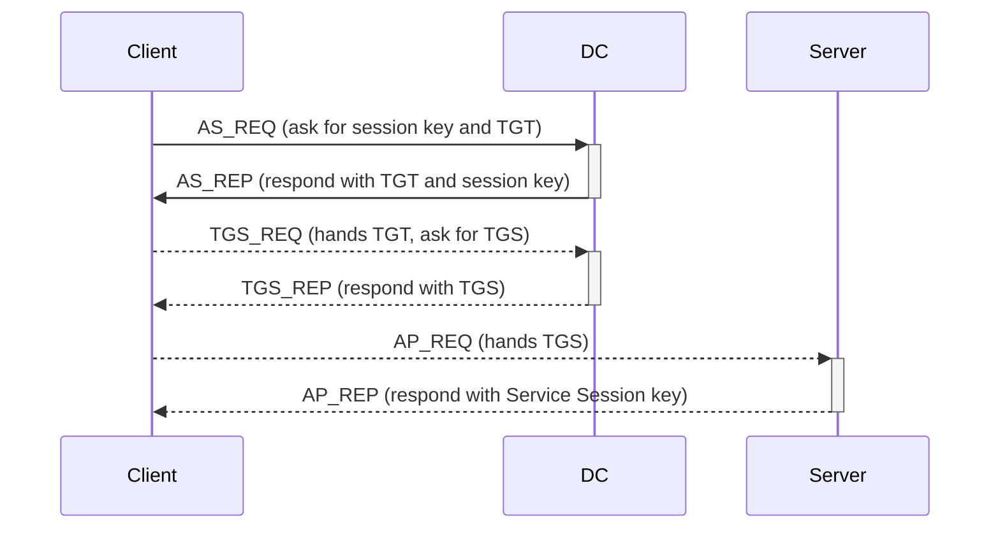


Kerberos armoring has three security advantages :

1. The **security encryption of the AS_REP/AS_REQ (TGT requests) is improved**. 
	- In the standard version of Kerberos, the Kerberos [[Appendix - Forms of access control and secrets in Active Directory environnements#Ekeys|ekeys]] are used to encrypt a timestamp in the AS_REQ. This AS_REQ can be intercepted on the network and [cracked offline](https://www.thehacker.recipes/ad/movement/kerberos/asreqroast)
	- In the armored version of Kerberos, [[Appendix - Forms of access control and secrets in Active Directory environnements#Armor Key & Challenge Key|new armor and challenge keys]] are forged using the user's Kerberos ekeys and the computer's session key
		- [Here is a diagram ](http://aurelien26.free.fr/kerberos/AS-REQ.pdf)from @aurelien26 of the resulting AS_REQ encryption, and here is the parsed [PCAP](http://aurelien26.free.fr/kerberos/03_compound/AS_REQ.html)
	- The AS_REP/AS_REQ requests of the computer account authentication is less vulnerable to attack since computers session keys are much more secured than user's eKeys.

2. The KDC can now **decide from which computer the user is allowed to request its TGT**
	- In addition to the computer's session key being reused, the computer's TGT is also passed as argument inside [AS_REQ](http://aurelien26.free.fr/kerberos/03_compound/AS_REQ.html) 
	- The KDC can decrypts this TGT and securely identify the originating device for a given authentication request. A specific subkey encrypted with the computer's current session key is additionally passed in this new AS_REQ. This construction guarantees that both the KDC (through the session key) and the client (through the subkey) contribute to the armor key.
	- From this, the KDC can technically perform access control (though only if Kerberos is used)
	- Here is a diagram of the improved FAST AS_REQ versus the standard AS_REQ : 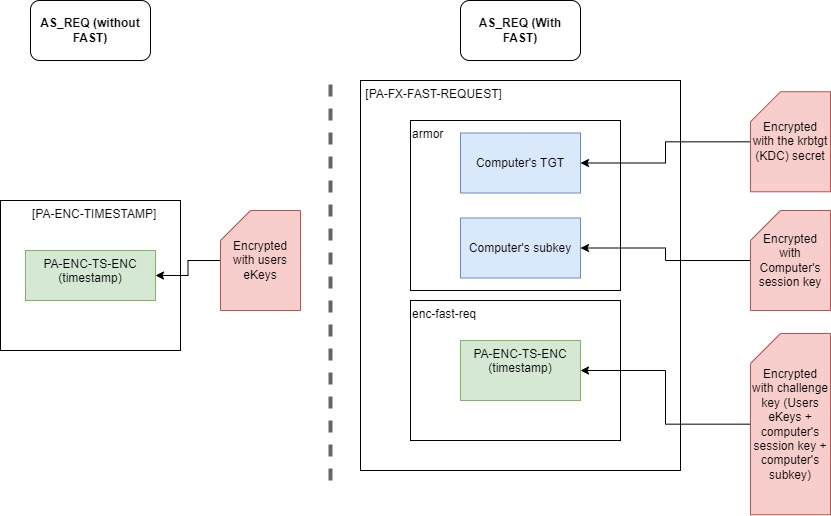


3. The KDC can now **decide from which computer the user is allowed to request access to a specific service**
	- In the same manner as the FAST AS_REQ, a new [FAST TGS_REQ](http://aurelien26.free.fr/kerberos/03_compound/TGS2_REP.html) can now pass in the computer's TGT as argument. The KDC is now also allowed to check if the service access is requested from a specific computer.
	 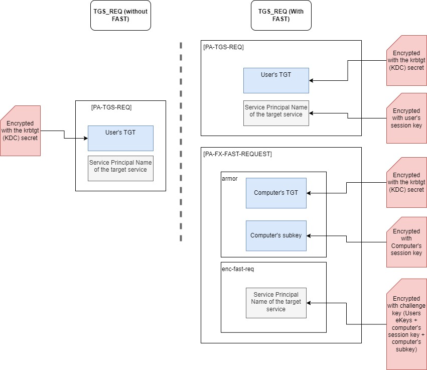
	- Also, the service does not have to be compatible with this access control. The KDC is authoritative TGS delivery and can restrict service access all by itself (obviously services could accept NTLM authentication but the KDC can decide to refuse it).

When Kerberos armoring is enable, the KDC can control the device from which users authenticates and make decisions based on it (apply security policies for access control).

> [!INFO] On "subkey" key generation 
> Upon user authentication, the client computer already has a valid TGT and a session key to communicate securely with the KDC. While the TGT is included is the new FAST AS_REQ "as is", the computer also generate a "subkey" and combines it with the other keys to obtain the armor key. This additional subkey is generated using the system-time, its name, and potentially a specific message that identify the purpose of the key generation (FAST user authentication). See [RFC 4120](https://datatracker.ietf.org/doc/html/rfc4120#page-29) for details on how authenticator sub keys are generated by the authentication client. 

 >[!info] On "Passing the computer's TGT into the TGS_REQ"
 > This last part is referred to as "composed authentication", i.e when security attributes from the originating device AND security attributes from the authenticating user are checked in a authentication policy to determine access. See TGS restriction restriction example in [[#Scenario 3 - TGS request restriction to services running under user accounts (not tested)|scenario 3]].
 >  
 > It is not mandatory to pass in the computer's TGT into TGS requests. In fact, the KDC does not do it unless it's needed in an authentication policy. The service itself would not be able to track the device because AP_REQ remain unchanged.
## Previously existing access control (User Rights Assigments)

- As default behavior, [domain users are allowed to open a windows session on any device (workstation or server) on the domain](https://learn.microsoft.com/en-us/previous-versions/windows/it-pro/windows-10/security/threat-protection/security-policy-settings/allow-log-on-locally#default-values)(interactive login). Though RDP access is [restricted to device administrators and RDP users. ](https://learn.microsoft.com/en-us/previous-versions/windows/it-pro/windows-10/security/threat-protection/security-policy-settings/allow-log-on-through-remote-desktop-services#default-values)
- [User Rights Assignment](https://learn.microsoft.com/en-us/previous-versions/windows/it-pro/windows-10/security/threat-protection/security-policy-settings/user-rights-assignment) settings are constants stored in the `secedit.sdb` database. They determine which account is allowed to log in on a computer depending on their [Windows logon types](https://learn.microsoft.com/en-gb/windows-server/identity/securing-privileged-access/reference-tools-logon-types) .
```
# It can be exported using secedit.exe
PS C:\Users\audit> secedit.exe /export /db "C:\Windows\security\database\ secedit.sdb" /areas USER_RIGHTS /log secedit.log /cfg ./secedit.inf 

> [Privilege Rights]
 	SeNetworkLogonRight = *S-1-1-0,*S-1-5-11,*S-1-5-32-544,*S-1-5-32-554,*S-1-5-9
 	SeBatchLogonRight = *S-1-5-32-544,*S-1-5-32-551,*S-1-5-32-559,*S-1-5-32-568
 	SeServiceLogonRight = *S-1-5-80-0
 	SeInteractiveLogonRight = *S-1-5-32-544,*S-1-5-32-548,*S-1-5-32-549,*S-1-5-32-550,*S-1-5-32-551,*S-1-5-9
 	SeRemoteInteractiveLogonRight = *S-1-5-32-544
```
* There exist opposite "deny logon" constants  for each windows logon types (i.e *SeDenyInteractiveLogonRight , SeDenyServiceLogonRight, SeDenyNetworkLogonRight, SeDenyBatchLogonRight*). Those have priority over "allow logon" constants.
* Privilege rights can me changed with UserRightAssigment GPOs (for exemple, [Deny interactive logon](https://learn.microsoft.com/en-us/previous-versions/windows/it-pro/windows-10/security/threat-protection/security-policy-settings/deny-log-on-locally)).

* **From an administrator stand point**
	* Deny logon GPOs cannot push "deny all but exception group" type policies. They can only point specific user groups that are not allowed. 
	* GPOs are deployed accross a given organizational unit. If the domain arborescence is shaped with this in mind, access control might be a good solution. Although often times, servers are mixed together in the same organizational unit.
	* Here is an illustration of the problem 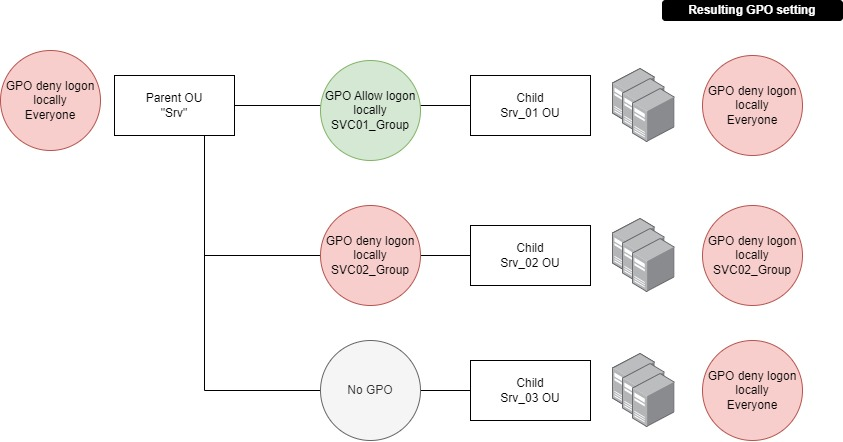
- **From a security stand point**
	* GPOs are configurations deployed locally that can be altered by attackers (for example, an attacker could coerce the authentication of an admin to a compromised device on which he has suppressed the access control GPO effectiveness) . On the other hand, **access control with FAST is centralized on KDC**.
- As seen later, the KDC can enforce FAST as a requirement but can also just provide support for it. In this later case, the access control with FAST would also suffer from the same vulnerability as the "deny access GPOs"
- It's common behavior among administrators to only play with administrator's rights to allow or deny access on servers (because server access is believed to be possible only through RDP which is not true). 

# What are authentication Policies & Silos

## Core concept

Authentication policies can be assigned to user, computer or service account through direct assignation or through Silo membership (i.e an authentication policy is assigned to a silo which is assigned to the target AD account). Authentication policies specify the conditions on which Kerberos tickets can be delivered (TGT or TGS). Once setup, the KDC can leverage Kerberos armoring to apply those restrictions.

For example, an authentication policy assigned to a user account **might impose conditions on which he can obtain a TGT**.  This authentication policy might require that the user make its TGT request from a computer that is member of a specific group or Silo (see [[#Scenario 1 - TGT request restriction | Scenario 1]] further down). If the user makes a connection from another device, the TGT request is refused.

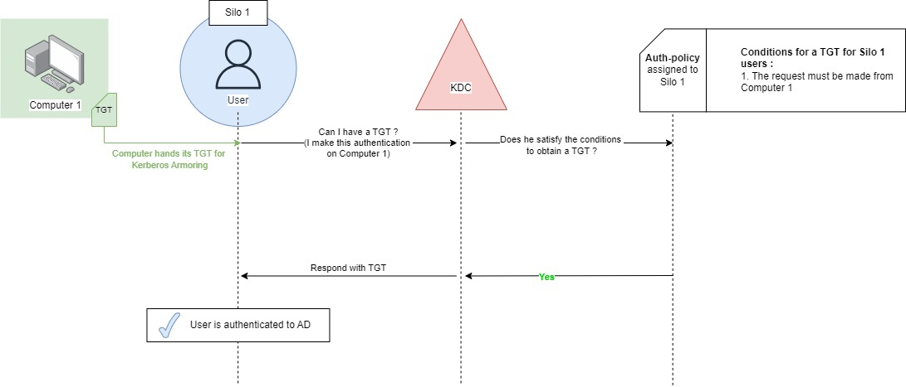

Another example, a service is running under an user account context. An authentication policy assigned to this user account **might impose conditions on which other user can access this service  (i.e request a TGS for it).** The authentication policy might require those other account to be member of a specific group or silo - see [[#Scenario 2 - TGS request restriction to Windows session |Scenario 2]] and [[#Scenario 3 - TGS request restriction to services running under user accounts (not tested)| Scenario 3]]. On Scenario 2, the service is the windows login session and it is running under the computer account running context but the operation remains the same (the user still require a TGS to access its windows session and an authentication policy can restrict this request). 

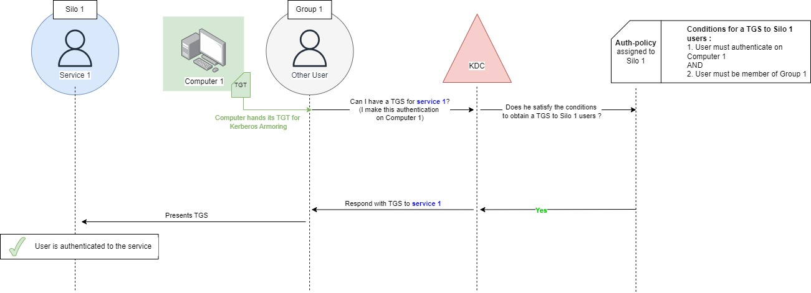

* Authentication Silos and policies are two class of objects defined in the *configuration* naming context in `Services > AuthN policy configuration > AuthN Silos / AuthN Policies
- Authentication Policies can apply TGT restriction to users and service account
	- Conditions are written in the <Users/serviceAccount>AllowedToAuthenticateFrom attribute on the auth policy object
	- This cannot apply to computer since you cannot armor computer TGT requests
- Authentication Policies can apply TGS restriction targeted at user/computer/service account
	- Conditions are written in the <Users/serviceAccount/Computer> AllowedToAuthenticateTo

When the KDC validate the client's compliance to the authentication policy, 
1. It write the silo's name into the user's PAC information.
	- 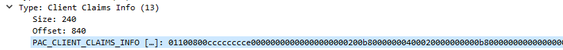
2. It raises a flag in the PAC (adds a dummy SID "Claims Valid" into the PAC of the user's TGT).
	 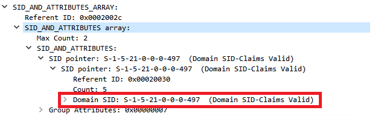


>[!Info] Audit mode
>Authentication Silos can be fully deployed in audit mode for test purposes. Events are created on the domain controller if enabled (see [[#Setup audit logs for authentication policy]])
## "Desambiguation" of terms

### On authentication policy

Be aware Microsoft makes little effort to make authentication silos easy to understand. 

- The Active Directory Administrative Center GUI sometimes refers to computer account as "users" because (from a technical stand point), user and computer accounts are both AD accounts with similar data structure and behaviors (i.e has a password, a SamAccountName and group membership, makes authentication)
- "Service Sign on" and "Service Accounts" are in fact [Group Managed Service Accounts](https://learn.microsoft.com/fr-fr/windows-server/identity/ad-ds/manage/group-managed-service-accounts/group-managed-service-accounts/group-managed-service-accounts-overview) (Those are special account used by services that negociate a password reroll every 30 days). 
- But usually, services use a normal user account to authenticate. Those are referred to as "user account". This is the reason why "restricting TGS requests targeted to user accounts" might sound strange. It does make sense if those user account are actually used by services.

> [!Info] Use Powershell cmdlt
The powershell cmdlet `Get-ADAuthenticationPolicy` show authentication policy *AllowedToAuthenticateFrom/To* attributes which are the terms used in this article.

### On silo and policy assignation

>[!Warning] Writing users into the silo is not enough.
>Any new members of a silo cannot be registered only on the Silo object. The silo itself must be registered on the user account object

- Users can be assigned to authentication policies directly (without the use of silos).
- If silos are to be used, new members must be written on the silo object **and** on the new member account itself. Writing the silo as member only on the new member account won't be enough.  
- The new AD GUI must be used and both silos and new member account must be changed for the assignation to work.
	- 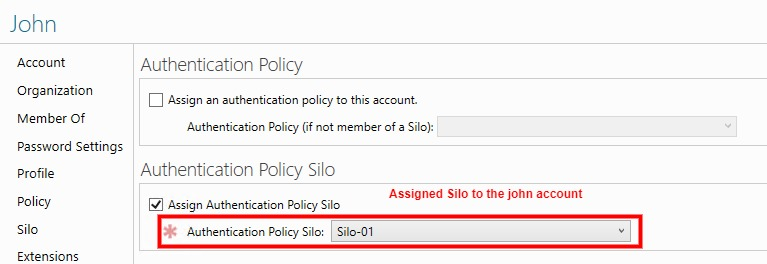
	- 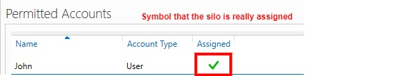
- For user accounts, you can login locally and verify silo membership in Powershell
	 - 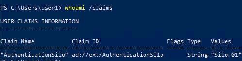 
 - Policy assignation is only managed on the DC's end. The computer does not have to know about it
- In any case, AD group members cannot be assigned to a silo. But authentication policy can target groups (see [[## Examples of Authentication policy implementation]])
- Authentication silos and authentication policy both can be managed by domain admins unless the default permissions on those containers are changed.
### Prerequisites for Kerberos FAST and authentication silos :

1. All DCs must be in Windows Server 2012 or higher
2. AD functional level must be 2012 or higher, but can be 2008 depending on the KDC configuration.
3. KDCs must enable FAST Kerberos 
	- Via [Group Policy Object](https://learn.microsoft.com/en-us/windows-server/identity/ad-fs/operations/ad-fs-compound-authentication-and-ad-ds-claims#step-1--enable-kdc-support-for-claims-compound-authentication-and-kerberos-armoring-on-the-default-domain-controller-policy) : "Enable KDC support for claims, compound authentication, and Kerberos armoring" on the domain controllers
	- Via registry key 
		- *Software\Microsoft\Windows\CurrentVersion\Policies\System\ Kerberos\Parameters\CbacAndArmorLevel*
			- This registry key tells the KDC how to manage FAST Kerberos requests 
			- It also tell it to extend the user's PAC with user's claims

Here are the possible registry key and corresponding GPO settings : 

| CbacAndArmorLevel | GPO setting                            | KDC Behavior                                                                                                                                                                 |
| ----------------- | -------------------------------------- | ---------------------------------------------------------------------------------------------------------------------------------------------------------------------------- |
| 0                 | Not supported                          | Will only accept standard Kerberos auth requests                                                                                                                             |
| 1                 | Supported                              | Will accept standard Kerberos authentication requests ; Will accept FAST authentication request if client asks for it (if the client raise a flag in its AS_REQ & TGS_REQ)   |
| 2                 | Always provide Claims                  | Same as "Supported" but the KDC always extends the user's PAC with the user's claims (will supposedly not break authentications \[not tested\])                              |
| 3                 | Fail unarmored Authentication requests | Will only accept Kerberos FAST ; This will break authentication from systems that are not compatible with FAST. This would also break computer joining process (not tested). |
>[! info] Always provide Claims
> CbacAndArmorLevel is for use cases where the authentication client is not a windows computer but still implement a keberos version that comply with [RFC 6113](https://datatracker.ietf.org/doc/html/rfc6113) (i.e with FAST).

4. **Authentication clients must support FAST Kerberos authentication** 
- Via [Group Policy Object](https://learn.microsoft.com/en-us/windows-server/identity/ad-fs/operations/ad-fs-compound-authentication-and-ad-ds-claims#step-2-enable-kerberos-client-support-for-claims-compound-authentication-and-kerberos-armoring-on-computers-accessing-federated-applications) : "Kerberos client support for claims, compound authentication and Kerberos armoring" on every computers in the domain
- Via registry key 
	- *Software\Microsoft\Windows\CurrentVersion\Policies\System\ Kerberos\Parameters\EnableCbacAndArmor*
		- This registry key tells the computer to forge Kerberos requests with armoring ; 
		- This registry key only tells the client computer to support armoring.
		
- The default configuration is to **not** support armoring. The use of authentication policies require all of the authentication clients to update their group policy settings


# Examples of Authentication policy implementation
## Scenario 1 - TGT request restriction 

* The user John and the device VMAZW10AUDIT are both assigned to Silo 1
* An authentication policy "Auth-pol-01" is assigned to Silo 1 with the following settings :
	1. User accounts that are members of Silo 1 have *AllowedToAuthenticateFrom* set to "computer accounts members of group 1"
	2. The Auth-pol-01 object changes its attribute *msDS-UserAllowedToAuthenticateFrom* with the following SDDL character chain :

```	
UserAllowedToAuthenticateFrom: O:SYG:SYD:(XA;OICI;CR;;;WD;(Member_of {SID(S-1-5-21-4260572771-3885837537-4253356189-7102)}))
```

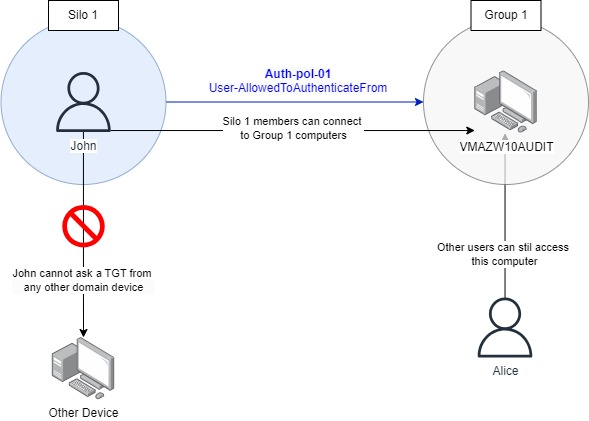

When John opens a Windows session on VMAZW10AUDIT, the Kerberos authentication chain begins
* John AS_REQ has the VMAZW10AUDIT's TGT nested in, the KDC checks John's assigned authenticated policy and sees that VMAZW10AUDIT is member of Group 1. John's TGT is handed to him in AS_REP
* While John has a TGT, Windows still needs him to authenticate to its logon processes. John forge a TGS_REQ with service name "*host/VMAZW10AUDIT*".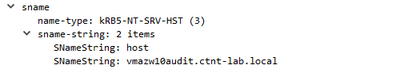 
* The KDC receives it and checks the computer's assigned authentication policy. VMAZW10AUDIT has no authentication policy so the TGS request is valid. 
* John accesses the computer

When John makes a connection to devices outside of Group 1, a TGT request is made with the corresponding computer's TGT. The KDC sees that this does not match John's assigned authentication policy.
* A pop-up message is shown to the user 
	* 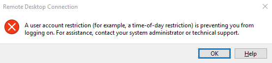
	* 
* The KDC responds with a *KRB ERROR: KRB5KDC_ERR_POLICY* 
* Event 105 is produced on the DC's end.
	* 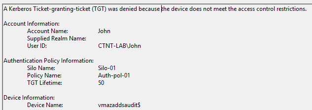
	* Device Name refers to the source of connection. On RDP session, the source device is cited as *Device Name* in event 105.

Alternative scenario 1 would be to have both the computer and users member of Silo-01. The AllowedToAuthenticateFrom can accept ACE based on Silos. In the following example, the *Auth-pol-1* to its own computer's silo.

```
UserAllowedToAuthenticateFrom : O:SYG:SYD:(XA;OICI;CR;;;WD;(@USER.ad://ext/AuthenticationSilo Any_of {"Silo-01"}))
```
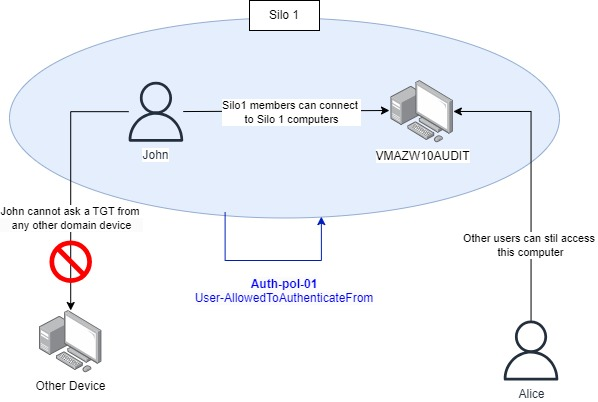
## Scenario 2 - TGS request restriction to Windows session

* The user John and the device VMAZW10AUDIT are both assigned to Silo 1
* An authentication policy "Auth-pol-01" is assigned to Silo 1 with the following settings :
	1. Computer accounts that are members of Silo 1 have *ComputerAllowedToAuthenticateTo* set to "Users accounts members of Silo-01"
	2. The *Auth-pol-01* object changes its attribute *msDS-ComputerAllowedToAuthenticateTo* with the following SDDL character chain :
```
ComputerAllowedToAuthenticateTo : O:SYG:SYD:(XA;OICI;CR;;;WD;(@USER.ad://ext/AuthenticationSilo Any_of {"Silo-01"}))
```

The resulting access control is the following :

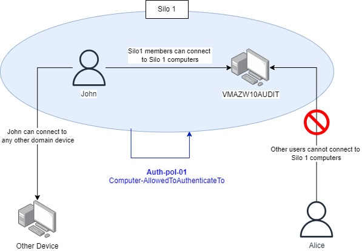

When John opens a windows session on VMAZW10AUDIT, the Kerberos authentication chain happens
1. John forge a AS_REQ and gets a TGT since no restriction is setup on this part (Auth-pol-01 *User-AllowedToAuthenticateTo* is empty)
2. John forge a TGS_REQ for service *host/VMAZW10AUDIT*. 
3. The KDC receives the request and check VMAZW10AUDIT assigned authentication policy (also Auth-pol-01). It sees that John is member of Silo-01 which satisfies the *ComputerAllowed-ToAuthenticateTo* condition. The KDC delivers the TGS to John
4. John opens its windows session

When Alice tries to connect to VMAZW10AUDIT, the TGS_REQ fails :
* The KDC responds with *KRB ERROR: KRB5KDC_ERR_POLICY*
* A pop-up message is shown to the user 

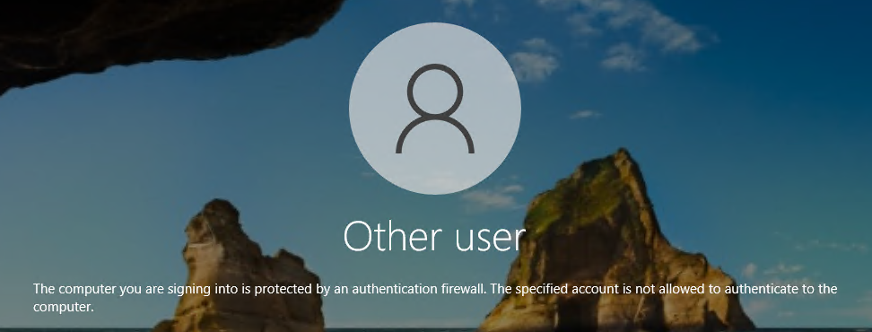
- Event 106 and  [Event 4821](https://www.ultimatewindowssecurity.com/securitylog/encyclopedia/event.aspx?eventid=4821) are created because the authentication policy worked (see event 106 thereafter) 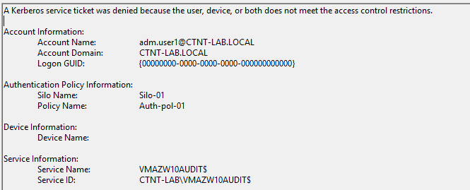
- [Event 4769](https://learn.microsoft.com/en-us/previous-versions/windows/it-pro/windows-10/security/threat-protection/auditing/event-4769) is created because a Kerberos service ticket request failed.


>[!Warning] TGS restriction apply to all services running under the AD computer's account
>A lot of services (web servers, SMB shares, print services) run under the hosting computer AD account (see the list of [Built-in SPNs for computer Account](https://learn.microsoft.com/en-us/previous-versions/windows/it-pro/windows-server-2003/cc772815(v=ws.10)#service-principal-names)). Those are also restricted under scenario 2. Again,  [Deny logon GPOs](https://learn.microsoft.com/en-us/previous-versions/windows/it-pro/windows-10/security/threat-protection/security-policy-settings/deny-log-on-locally) might be a better fit for this use case.
## Scenario 3 - TGS request restriction to services running under user accounts (not tested)

The authentication policy can restrict John's access to any service based on the service principal name (SPN) used by John in his TGS_REQ. All applications runs under a service principal (an AD account with a security descriptor and associated privileges).  SPNs are well documented [by Microsoft](https://learn.microsoft.com/en-us/windows/win32/ad/service-principal-names). They take a the shape of a character chain `service_class/AD_account_name` where the `service_class` is a generic name for the service (see [hackndo for more on this](https://en.hackndo.com/service-principal-name-spn/)). In scenario 2, the SPN used for Windows session login was `host/VMAZW10AUDIT`. 

- The AD authentication policies applies to the account name under which the service runs (part right of the SPN) ;
- The account requesting the service must satisfy the conditions stated by the SDDL character chain in the *User-AllowedToAuthenticateTo* attribute.

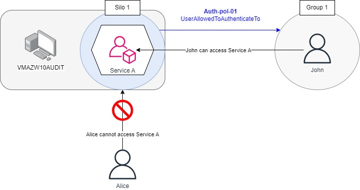

**Security principals being used by services in the domain**
- Events 4769 can be aggregated on domain controllers to get a sens of services being used in a given AD environnement (though often times, most of them are computers AD account)
- If any services runs under a user account, this user account will have a SPN that can be tracked
```
Get-ADUser -Filter 'ServicePrincipalName -like "*"' -Properties ServicePrincipalName | Select-Object SamAccountName, ServicePrincipalName
```
# NTLM incompatibility

While Kerberos will apply restrictions associated with authentication policies, systems can still fail over to NTLM.

* \[Scenario 1\] TGT restrictions will work but attackers can use NTLM to connect to systems 
* \[Scenario 2 & 3\] TGS restrictions will systematically fail over to NTLM

LSA memory dump on client systems show that NTLM secrets are still stored locally :

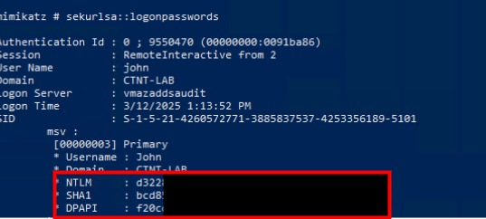
 
* Authentication policies have attributes *UserAllowedNTLMNetworkAuthentication* and 
*RollingNTLMSecret*. Those will not affect NTLM fail over capabilities.

* Microsoft recommends that users given membership of the protected user group for scenario 1 
* Undoubtedly, if no restriction to NTLM is locally set up (via [[Implementation of the Protected Users group#Using NTLM logs|GPO]]), Scenario 2 will not work ether

# Defensive use cases with Silos

* **Tier 0 access control**
	* Use Scenario 1 to ensure that only Tier 0 admins are allowed on Tier 0 servers and PAW
	* Use Scenario 2 to ensure that Tier 0 servers only accept Tier 0 admins
	* Use the built-in Administrator account ready for emergency access
	* Ensure that all Tier 0 accounts are member of Protect User group
	* Ensure that Tier 0 device have enabled *Network security: Restrict NTLM:  NTLM authentication in this domain* GPO

* **Granular and exclusive access control**
	* Scenario 1 can be used to give granular access to a set of servers mixed with other servers in an organizational unit. 
	* For exemple, a devops team are given Tier 1 accounts for the only purpose of accessing a given set of servers. Scenario 1 will make sure that those accounts cannot make a connection anywhere else.
	
* **Access control on Linux servers centralized on the DC's End**
	* Access control GPO can apply access control on Windows Device only. 
	* AD-joined Linux servers can apply access control within sssd local configuration (usually, a AD group is written in static in the sssd.conf file)
	* Authentication Silo can manage authentication from the DC's end.

* **Service account protection** 
	* Scenario 1 can be used to make sure a given service account is exclusively run on the server it is supposed to.
	* Service account can be assigned a authentication policy that will restrict them to a specific set of servers (Linux or Windows) on which their service can exclusively run

# Acknowledgment

Thanks to @AurelienBordes and his [paper for the STICCS](https://www.sstic.org/2017/presentation/administration_en_silo/) . This article use a lot of infos from his article.
# Annexe

## Setup audit logs for authentication policy 
### Enable log collection
* In  "_Microsoft-Windows-Authentication/AuthenticationPolicyFailures-DomainController_"
* Right click > property
* 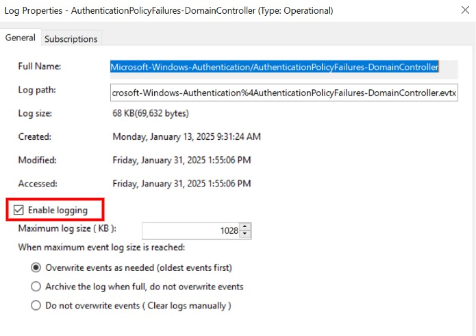
### Event description from @[Microsoft](https://learn.microsoft.com/fr-fr/windows-server/security/credentials-protection-and-management/authentication-policies-and-authentication-policy-silos#BKMK_ErrorandEvents)

| Event ID and Log         | Details                                                                                                                                                                                                                                                                                                                                                                                                   |
| ------------------------ | --------------------------------------------------------------------------------------------------------------------------------------------------------------------------------------------------------------------------------------------------------------------------------------------------------------------------------------------------------------------------------------------------------- |
| 101<br>NTLM was required | **An NTLM sign-in failure occurs because the authentication policy is configured.**<br><br>An event is logged in the domain controller to indicate that NTLM authentication failed because access control restrictions are required, and those restrictions cannot be applied to NTLM.<br><br>Displays the account, device, policy, and silo names.                                                       |
| 105<br><br>              | **A Kerberos restriction failure occurs because the authentication from a particular device was not permitted**.<br><br>An event is logged in the domain controller to indicate that a Kerberos TGT was denied because the device did not meet the enforced access control restrictions.<br><br>Displays the account, device, policy, silo names, and TGT lifetime. <br>                                  |
| 305<br>                  | **A potential Kerberos restriction failure might occur because the authentication from a particular device was not permitted**.<br><br>In audit mode, an informational event is logged in the domain controller to determine if a Kerberos TGT will be denied because the device did not meet the access control restrictions.<br><br>Displays the account, device, policy, silo names, and TGT lifetime. |
| 106<br>                  | **A Kerberos restriction failure occurs because the user or device was not allowed to authenticate to the server.**<br><br>An event is logged in the domain controller to indicate that a Kerberos service ticket was denied because the user, device, or both do not meet the enforced access control restrictions.<br><br>Displays the device, policy, and silo names.                                  |
| 306<br><br>              | **A Kerberos restriction failure might occur because the user or device was not allowed to authenticate to the server.**<br><br>In audit mode, an informational event is logged on the domain controller to indicate that a Kerberos service ticket will be denied because the user, device, or both do not meet the access control restrictions.<br><br>Displays the device, policy, and silo names.     |

## Inspect Kerberos tickets contents

If needed, Kerberos tickets can be inspected in a test environnement. 

>[!warning] Handling domain's secrets 
>The following process require exporting encryption keys (notably the KRBTGT's account key) and others. Those secrets should be handled with a lot of caution as they are critical to the entire domain's security

>[!info] FAST Kerberos needs both user and computer keys
>In FAST Kerberos authentication, the computer's TGT is passed as argument in the user's authentication. Both the user's and the computer's keys should be exported user authentication inspection

Exporting the ntds.dit database with ntdsutil
```
ntdsutil.exe
> ac i ntds
> ifm
> create full c:\temp
```

Getting domain secrets with impacket tools installed on a windows machine
```
python.exe impacket-master\examples\secretsdump.py -system .\registry\SYSTEM -ntds '.\Active Directory\ntds.dit' LOCAL
```

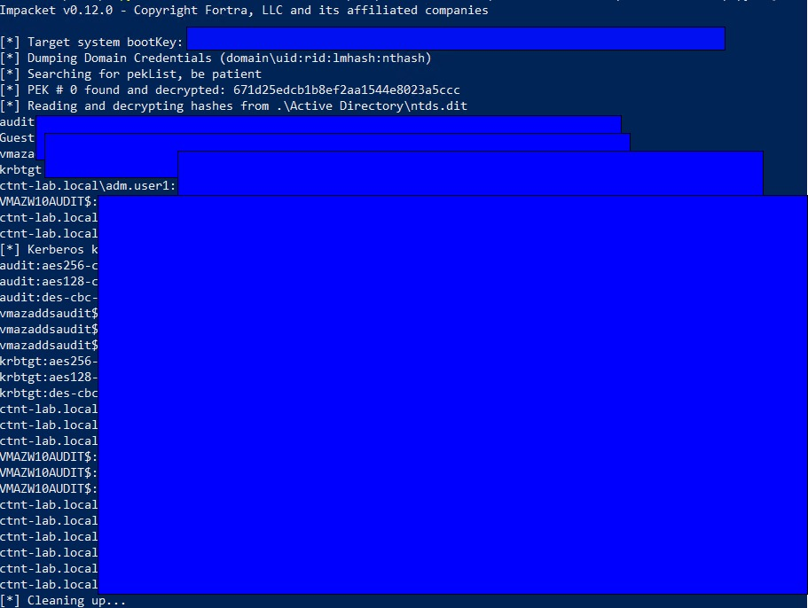
AES-256 keys can be written into the @Dirkjam script "keytab.py" and the resulting keytab file can be imported into Wireshark. A more complete procedure is available [here](https://medium.com/tenable-techblog/decrypt-encrypted-stub-data-in-wireshark-deb132c076e7)

Here is an example of a the PAC of a user's TGT (the client Claims Info field is empty in this case scenario)
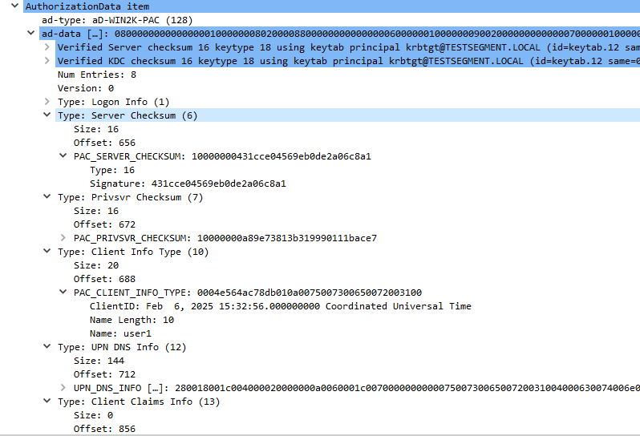
## Policy silos attributes
table from [learn.microsoft.com](https://learn.microsoft.com/en-us/windows-server/security/credentials-protection-and-management/authentication-policies-and-authentication-policy-silos#about-authentication-policies)

|     Type     | Display Name                               | Description                                                                                                                                    |
| :----------: | :----------------------------------------- | :--------------------------------------------------------------------------------------------------------------------------------------------- |
|   **User**   | User Authentication Policy                 | Specifies which AuthNPolicy should be applied to users who are assigned to this silo object.                                                   |
|   **User**   | User Authentication Policy Backlink        | This attribute is the back link for msDS-UserAuthNPolicy.                                                                                      |
|   **User**   | ms-DS-User-Allowed-To-Authenticate-To      | This attribute is used to determine the set of principals allowed to authenticate to a service running under the user account.                 |
|   **User**   | ms-DS-User-Allowed-To-Authenticate-From    | This attribute is used to determine the set of devices to which a user account has permission to sign in.                                      |
|   **User**   | User TGT Lifetime                          | Specifies the maximum age of a Kerberos TGT that is issued to a user (expressed in seconds). Resultant TGTs are non-renewable.                 |
| **Computer** | Computer Authentication Policy             | Specifies which AuthNPolicy should be applied to computers that are assigned to this silo object.                                              |
| **Computer** | Computer Authentication Policy Backlink    | This attribute is the back link for msDS-ComputerAuthNPolicy.                                                                                  |
| **Computer** | ms-DS-Computer-Allowed-To-Authenticate-To  | This attribute is used to determine the set of principals that are allowed to authenticate to a service running under the computer account.    |
| **Computer** | Computer TGT Lifetime                      | Specifies the maximum age of a Kerberos TGT that is issued to a computer (expressed in seconds). It is not recommended to change this setting. |
| **Service**  | Service Authentication Policy              | Specifies which AuthNPolicy should be applied to services that are assigned to this silo object.                                               |
| **Service**  | Service Authentication Policy Backlink     | This attribute is the back link for msDS-ServiceAuthNPolicy.                                                                                   |
| **Service**  | ms-DS-Service-Allowed-To-Authenticate-To   | This attribute is used to determine the set of principals that are allowed to authenticate to a service running under the service account.     |
| **Service**  | ms-DS-Service-Allowed-To-Authenticate-From | This attribute is used to determine the set of devices to which a service account has permission to sign in.                                   |
| **Service**  | Service TGT Lifetime                       | Specifies the maximum age of a Kerberos TGT that is issued to a service (expressed in seconds).                                                |

